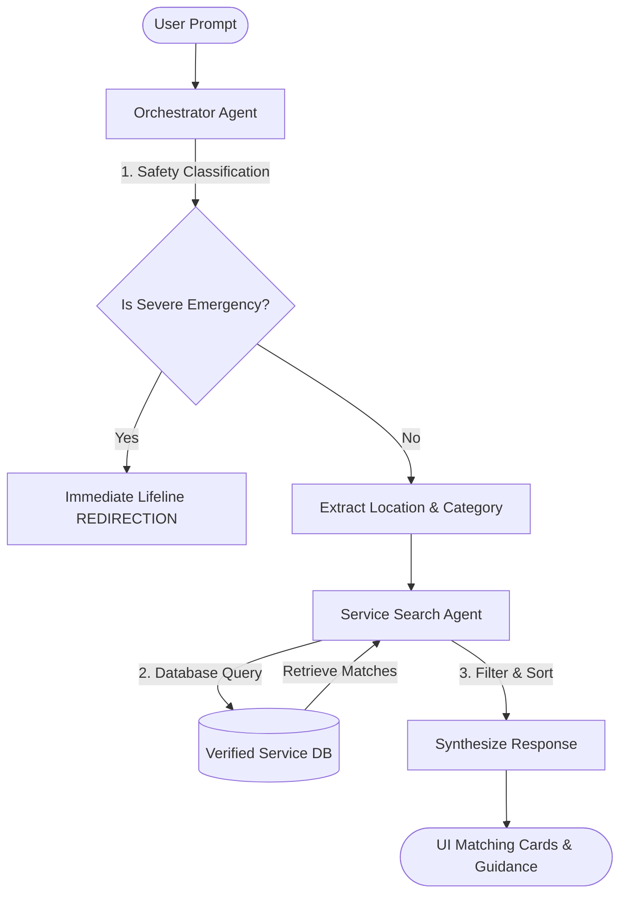

# MATCH - AI Crisis Resource Directory

MATCH is an AI-powered prototype designed to instantly match individuals in crisis with verified, local support services (such as food pantries, emergency shelter, and mental health helplines). 

Developed for the **Google & Kaggle AI Agents Capstone**, this system leverages a robust Multi-Agent architecture to provide reliable, safe, and immediate resource guidance.

---

## 🛡️ Multi-Agent Architecture & Solution Design

To guarantee distinct task separation, safety, and correctness, MATCH divides responsibilities across specialized agent layers:



1. **Orchestrator Agent (`agents/orchestrator.py`)**:
   * **Input Safety Screening**: Inspects query text for severe, immediate life-threatening scenarios (e.g., active self-harm, active domestic violence).
   * **Emergency Redirection**: If a severe crisis is detected, it bypasses database search and immediately serves critical hotlines (e.g. 988 or 911).
   * **Intent Classification**: Normalizes requested support categories (e.g. `mental_health`, `food_assistance`, `shelter`, `medical`).
   * **Geographic Entity Extraction**: Extracts cities, zip codes, and states mentioned in the prompt.
   * **Structured Responses**: Dynamically synthesizes an empathetic and concise summary.

2. **Service Search Agent (`agents/search_agent.py`)**:
   * **Database Querying**: Matches the extracted intent category against our verified support directories.
   * **Geographic Filtering**: Matches location parameters against address, city, state, and zip code details.
   * **Failsafe Support**: Returns national defaults if no local matches are found.

3. **Frontend Visualization Panel**:
   * During processing, the UI animates each agent status state (Orchestrator processing, Search agent querying, Security checks) so judges can visually inspect the multi-agent system execution flow.

---

## 🔑 Key Features
* **Zero-Friction Sandbox Mode**: Includes a secure settings modal where judges or users can input their own Gemini API Key. If the backend key hits a quota limit, the app gracefully runs queries on the custom key.
* **Premium Dark Theme UI**: Built with responsive vanilla CSS, modern Outfit/Inter typography, subtle glassmorphism borders, and animated HTML5 dialog transitions.
* **No hardcoded secrets**: All API keys are loaded strictly from standard environment configurations.

---

## 🚀 Setup & Execution

### Option A: Local Python Environment (Recommended)

1. **Initialize the Virtual Environment**:
   ```bash
   python3 -m venv venv
   source venv/bin/activate
   ```

2. **Install Dependencies**:
   ```bash
   pip install -r requirements.txt
   ```

3. **Configure Environment**:
   ```bash
   cp .env.example .env
   # Add your key to .env, or configure it dynamically inside the web interface
   ```

4. **Launch the Application**:
   ```bash
   python app.py
   ```
   Open `http://localhost:8080` in your web browser.

### Option B: Docker Container

1. **Run with Docker Compose**:
   ```bash
   docker-compose up --build
   ```
   Open `http://localhost:8080` in your web browser.

---

## ☁️ Deployment (Google Cloud Run)

To deploy this application from your personal Google Cloud Platform account:

1. **Install and Configure Google Cloud SDK**:
   ```bash
   gcloud auth login
   gcloud config set project YOUR_GCP_PROJECT_ID
   ```

2. **Build and Deploy Directly from Codebase**:
   ```bash
   gcloud run deploy match-crisis-directory \
       --source . \
       --platform managed \
       --region us-central1 \
       --allow-unauthenticated \
       --set-env-vars="GEMINI_MODEL=gemini-2.5-flash"
   ```

3. **Secure API Key Configuration**:
   To prevent credentials leaking, configure your server-side API key using Google Cloud Secret Manager and mount it to your Cloud Run service:
   ```bash
   gcloud secrets create gemini-api-key --data-file=".env"
   ```

---

## 📂 Project Structure

* [app.py](file:///vms_and_github/Github/kaggle-google-CAPSTONE-june-2026/app.py) - Main FastAPI Server entry point.
* [agents/orchestrator.py](file:///vms_and_github/Github/kaggle-google-CAPSTONE-june-2026/agents/orchestrator.py) - Safety screening and intent parser.
* [agents/search_agent.py](file:///vms_and_github/Github/kaggle-google-CAPSTONE-june-2026/agents/search_agent.py) - Database query layer.
* [data/resources.json](file:///vms_and_github/Github/kaggle-google-CAPSTONE-june-2026/data/resources.json) - Verified emergency listings database.
* [static/index.html](file:///vms_and_github/Github/kaggle-google-CAPSTONE-june-2026/static/index.html) - Visual matching interface dashboard.
* [static/index.css](file:///vms_and_github/Github/kaggle-google-CAPSTONE-june-2026/static/index.css) - Theme stylesheets.
* [static/index.js](file:///vms_and_github/Github/kaggle-google-CAPSTONE-june-2026/static/index.js) - App rendering controller.
* [Dockerfile](file:///vms_and_github/Github/kaggle-google-CAPSTONE-june-2026/Dockerfile) - Production environment container blueprint.