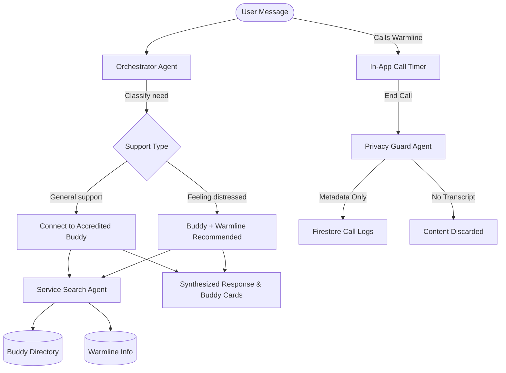

# MySupportBuddy — Peer Support & Crisis Resource Platform

> **✅ Project Live on Google Cloud Run:** [https://mysupportbuddy-170198436835.us-central1.run.app](https://mysupportbuddy-170198436835.us-central1.run.app)

**MySupportBuddy** is an AI-powered peer support platform that connects individuals with **accredited, vetted peer support buddies** for warm, judgment-free conversations — and provides a direct link to a **General Support Warmline** when professional support is needed.

Developed for the **Google & Kaggle AI Agents Capstone**, MySupportBuddy demonstrates a responsible, privacy-first multi-agent architecture built around human wellbeing and veteran-friendly design principles.

---

## 💡 What MySupportBuddy Does

1. **Talk to an Accredited Buddy**: Users can reach out to a certified, vetted peer support buddy at any time. Buddies are real people who have passed certification and vetting requirements before appearing on the platform.
2. **Interactive Demo Mode (Play Cards)**: Visitors can try instant one-click demonstration cards simulating real-world peer support scenarios (Veteran Transition, Peer Buddy Match, 24/7 Warmline Info, and Caregiver Support).
3. **Access the General Warmline**: For situations where the user feels overwhelmed or needs professional support, the General Support Warmline is always one tap away — confidential and available 24/7.
4. **Privacy-Protected Buddy Notifications & Persistent Logs**: When a user calls the warmline through the app:
   - ✅ The buddy is notified *that* their peer called, and *for how long* (persisted securely in Google Cloud Firestore).
   - ❌ The buddy is **never** told what was discussed — call content is discarded and never recorded.
   - This allows the buddy to proactively check in with care, maintaining strict **Do No Harm** access boundaries.
5. **Conversation History & Trash Bin**: Authenticated users can manage their chat sessions, view historical conversations, and utilize a soft-delete **30-Day Trash Bin** modeled after enterprise data retention standards.

---

## 🛡️ Role-Based Access Control (RBAC) & Responsibilities (#1, #4, #5)

MySupportBuddy enforces strict role-based access boundaries to protect human wellbeing, maintain confidentiality, and uphold **Do No Harm** ethical principles:

| Role | Access Level & Key Responsibilities | Ethics & Governance |
|---|---|---|
| **👤 Patient** | Standard user portal. Can interact with AI peer support, browse the accredited buddy roster, call the 24/7 warmline, and manage chat history/trash bin. | Complete control over personal data and caregiver consent toggles. |
| **🛡️ Support Buddy** | Dedicated **Buddy Care Dashboard**. Accesses assigned peer support queue, views warmline call metadata (duration only), and logs non-clinical supportive notes. | Operates under accredited peer guidelines (#5). Absolutely no access to call transcripts or clinical records. |
| **🩺 Clinician** | Secure **Clinician Triage Portal**. Reviews high-priority escalated triage cases, symptom reports, and diagnostic risk levels. | Bound by HIPAA confidentiality and clinical authorization. Roadmap includes TBI neuro-imaging scan analysis (#2). |
| **🌟 Caregiver** | **Caregiver Wellness Portal**. Monitors high-level mood summaries and check-in statuses for family members. | Strict consent policy: access is dynamically gated by patient consent settings. |

---

## 🤖 Multi-Agent Architecture



### Agent Roles

| Agent | Role |
|---|---|
| **Orchestrator Agent** (`agents/orchestrator.py`) | Classifies the user's emotional support needs (general/distressed), synthesizes warm responses, and routes to the appropriate resource. |
| **Service Search Agent** (`agents/search_agent.py`) | Queries the buddy directory and warmline database, returning available buddies and crisis line info. |
| **Privacy Guard** (`app.py /api/crisis-call-log`) | Logs only call metadata (timestamp + duration) to Firestore for buddy awareness. The call content is discarded and never stored or shared. |

---

## 🗂️ Project Structure

```
.
├── agents/
│   ├── orchestrator.py     # Triage, classification, response synthesis
│   └── search_agent.py     # Buddy directory & crisis line querying
├── data/
│   └── resources.json      # Accredited buddies + General Warmline data
├── static/
│   ├── index.html          # Main UI dashboard (with responsive Mobile Bottom Nav)
│   ├── index.css           # Light cream/forest-green veteran-friendly design system
│   └── index.js            # Stateful conversational UI, JWT auth, trash bin, and demo mode
├── app.py                  # FastAPI server with JWT auth, Firestore CRUD, and call logs
├── requirements.txt
├── Dockerfile
├── docker-compose.yml
├── .env.example
└── README.md
```

---

## 🚀 Setup & Running Locally

### Option A: Python Environment

```bash
# 1. Create and activate virtual environment
python3 -m venv venv
source venv/bin/activate

# 2. Install dependencies
pip install -r requirements.txt

# 3. Configure environment
cp .env.example .env
# Edit .env and configure your GEMINI_API_KEY and JWT_SECRET

# 4. Run the server
python app.py
```

Open **http://localhost:8080** in your browser.

### Option B: Docker

```bash
# 1. Build and run containers in the background
docker-compose up -d --build

# 2. Check container status
docker-compose ps

# 3. Stream live application logs
docker-compose logs -f

# 4. Stop and remove containers
docker-compose down
```

---

## ☁️ Deploying to Google Cloud Run

```bash
# Authenticate and set your project
gcloud auth login
gcloud config set project YOUR_GCP_PROJECT_ID

# Deploy from source
gcloud run deploy mysupportbuddy \
    --source . \
    --platform managed \
    --region us-central1 \
    --allow-unauthenticated \
    --set-env-vars="GEMINI_MODEL=gemini-2.5-flash" \
    --set-secrets="GEMINI_API_KEY=gemini-api-key:latest,JWT_SECRET=jwt-secret:latest"
```

---

## 🔒 Privacy Design & Database Principles

- **Cloud Firestore Native Integration**: User accounts and persistent warmline logs are securely stored in Google Cloud Firestore.
- **Stateless JWT Authentication**: Passwords are hashed using PBKDF2 SHA-256 with stateless bearer token authentication.
- **Content is never stored**: Warmline call transcripts are discarded immediately. Only metadata (time, duration) is retained for buddy notifications.
- **Do No Harm access boundaries**: Designed with role-specific access controls (Patient, Buddy, Clinician, Caregiver) ensuring maximum privacy.
- **Pure Responsive CSS**: Responsive mobile bottom navigation and modals implemented without heavy external mobile frameworks.

---

## 📋 Evaluation Track

This project is submitted under the **Agents for Good** track of the Kaggle AI Agents Capstone.

**License**: Developed for educational purposes under Kaggle AI Agents Capstone guidelines. All rights reserved by the author. [@genidma](https://github.com/genidma)