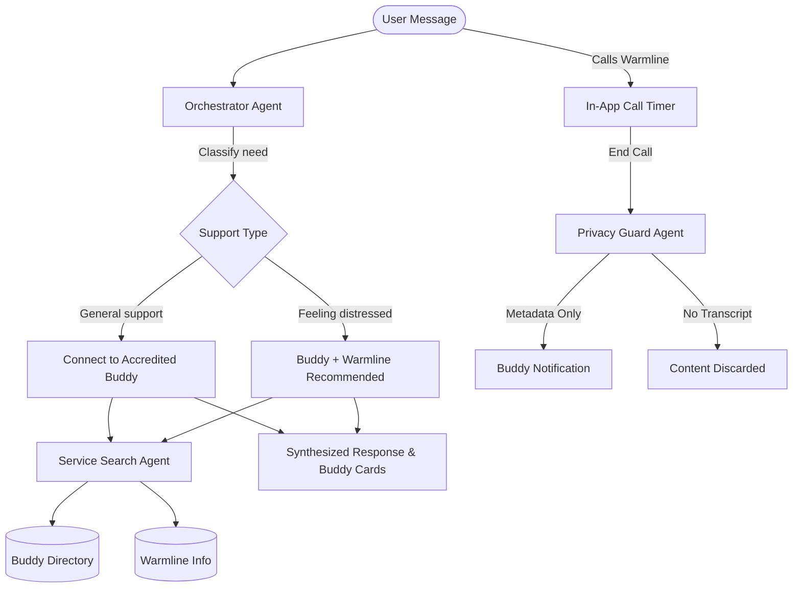

# MATCH — Peer Support & Crisis Resource Platform

**MATCH** is an AI-powered peer support platform that connects individuals with **accredited, vetted peer support buddies** for warm, judgment-free conversations — and provides a direct link to a **General Support Warmline** when professional support is needed.

Developed for the **Google & Kaggle AI Agents Capstone**, MATCH demonstrates a responsible, privacy-first multi-agent architecture built around human wellbeing.

---

## 💡 What MATCH Does

1. **Talk to an Accredited Buddy**: Users can reach out to a certified, vetted peer support buddy at any time. Buddies are real people who have passed certification and vetting requirements before appearing on the platform.

2. **Access the General Warmline**: For situations where the user feels overwhelmed or needs professional support, the General Support Warmline is always one tap away — confidential and available 24/7.

3. **Privacy-Protected Buddy Notifications**: When a user calls the warmline through the app:
   - ✅ The buddy is notified *that* their peer called, and *for how long*.
   - ❌ The buddy is **never** told what was discussed — that is fully private.
   - This allows the buddy to proactively check in with care, without compromising the user's privacy.

---

## 🤖 Multi-Agent Architecture



### Agent Roles

| Agent | Role |
|---|---|
| **Orchestrator Agent** (`agents/orchestrator.py`) | Classifies the user's emotional support needs (general/distressed), synthesizes warm responses, and routes to the appropriate resource. |
| **Service Search Agent** (`agents/search_agent.py`) | Queries the buddy directory and warmline database, returning available buddies and crisis line info. |
| **Privacy Guard** (via `app.py /api/crisis-call-log`) | Logs only call metadata (timestamp + duration) for the buddy. The call content is discarded and never stored or shared. |

---

## 🗂️ Project Structure

```
.
├── agents/
│   ├── orchestrator.py     # Triage, classification, response synthesis
│   └── search_agent.py     # Buddy directory & crisis line querying
├── data/
│   └── resources.json      # Accredited buddies + General Warmline data
├── static/
│   ├── index.html          # Main UI dashboard
│   ├── index.css           # Dark theme design system
│   └── index.js            # Buddy cards, call timer, buddy notifications
├── app.py                  # FastAPI server with support + call-log endpoints
├── requirements.txt
├── Dockerfile
├── docker-compose.yml
└── .env.example
```

---

## 🚀 Setup & Running Locally

### Option A: Python Environment

```bash
# 1. Create and activate virtual environment
python3 -m venv venv
source venv/bin/activate

# 2. Install dependencies
pip install -r requirements.txt

# 3. Configure environment
cp .env.example .env
# Edit .env and add your GEMINI_API_KEY

# 4. Run the server
python app.py
```

Open **http://localhost:8080** in your browser.

> **No API Key?** You can configure your key directly in the UI settings panel (🔑 API Key button) — it is stored in browser localStorage and sent securely per-request.

### Option B: Docker

```bash
docker-compose up --build
```

---

## ☁️ Deploying to Google Cloud Run

```bash
# Authenticate and set your project
gcloud auth login
gcloud config set project YOUR_GCP_PROJECT_ID

# Deploy from source
gcloud run deploy match-peer-support \
    --source . \
    --platform managed \
    --region us-central1 \
    --allow-unauthenticated \
    --set-env-vars="GEMINI_MODEL=gemini-2.5-flash"

# Store your API key securely using Secret Manager
gcloud secrets create gemini-api-key --data-file=".env"
```

---

## 🔒 Privacy Design Principles

- **Content is never stored**: Warmline call transcripts are discarded. Only metadata (time, duration) is retained in-session for the buddy notification.
- **No hardcoded secrets**: All API keys are loaded from environment variables or user-provided settings.
- **Buddy boundary**: The buddy view shows only the notification card — never the conversation.

---

## 📋 Evaluation Track

This project is submitted under the **Agents for Good** track of the Kaggle AI Agents Capstone.

**License**: Developed for educational purposes under Kaggle AI Agents Capstone guidelines. All rights reserved by the author. [@genidma](https://github.com/genidma)